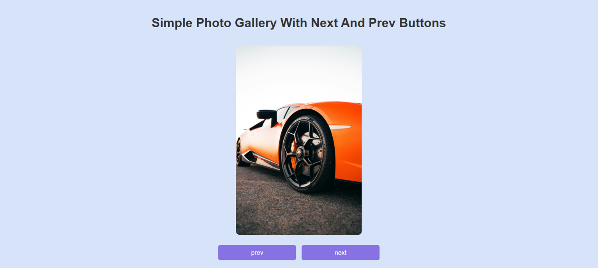

# Simple Photo Gallery

A clean and interactive photo gallery with navigation controls, built using HTML, CSS, and Vanilla JavaScript.

## Features

- Navigate through images using "Previous" and "Next" buttons.
- Simple and intuitive user interface with RTL support.
- Fully responsive layout.
- Lightweight and fast loading.

## Technologies Used

- HTML5
- CSS3 (Flexbox, Layout Styling)
- JavaScript (DOM Manipulation, Event Listeners)

## How to Run

Simply open `index.html` in any modern web browser.
